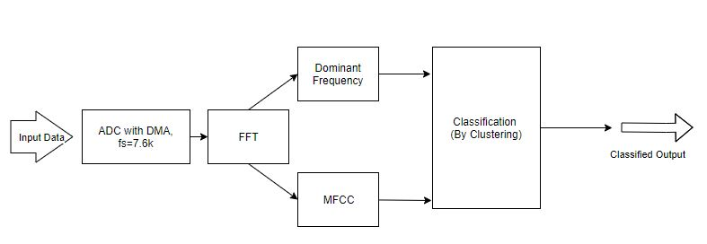
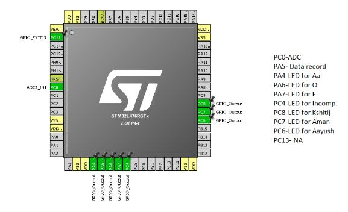
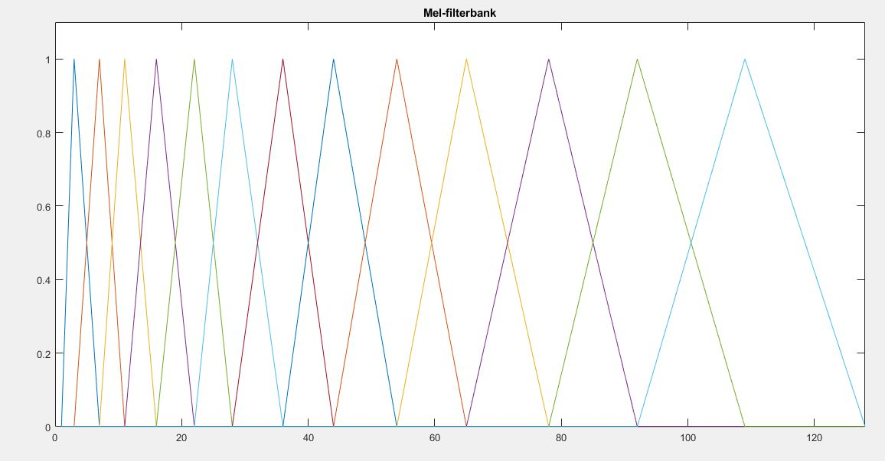

# Voice based Tone and Person Identification on STM32L4

This project was made as part of EED308- Embedded System Hardware, Spring 2018 at Shiv Nadar University under the supervised guidance of Professor R.N Biswas.

In this project, we created a smart voice based human identification system that is capable of recognizing periodic sounds like aa, ee & oo and the human who is pronouncing them. The audio input is sampled through a microphone and analyzed in real time using STM32L4 series microcontroller. Our system is trained to recognize  the voice of the speaker on which the model is trained in our case we three. In addition, it is also capable of identifying the sounds of aa,ee,oo pronounced by any human being  in real time. Some of the topics we explored extensively in this project are Fast Fourier Transform, human speech analysis, MFCC and Machine Learning techniques for classification.

## Key Points for this Project 

### Usage of IDE's

Free versions of IDE's like Keil, IAR wont work with CMSIS DSP Library, since they have limited memory in the free version. Instead free IDE's like Atollic True Studio, GNU Eclipse based free IDE's should be used which dont have the memory constraint.

### Installation of CMSIS DSP Library

Download the CMSIS Library from the following [link](https://github.com/ARM-software/CMSIS_5) and follow the instruction as given in the [video](https://www.youtube.com/watch?v=dLHkYlF3suc&feature=youtu.be).

## Block Diagram



## Materials needed
- Analog Mic/ Sound Detector Module
- Resistance and Capacitances to make a low pass filter
- LED


## Initialization in Cube Mx

### For ADC-DMA
We need sampling frequency of the ADC to be around 8k Hz since the voice signal can hardly exceed this voice.
We initialized ADC DMA in Continuous Mode with High Speed Clock Frequency as 16 Mhz. The Prescaler value of 8 was chosen so that ADC Clock Frequency=2Mhz. Nnumber of cycles is chosen to be 247.5, so that the sampling freq= 7600 Hz.

Sampling frequency=2 Mhz/(247.5 + Tconv), where Tconv=12.5 for STM32L4. Refer to this document- [link](www.st.com/resource/en/application_note/cd00258017.pdf)

Total of 256 data points is being stored in the array which is stored circularly.

### For Interrupt Generation

PC13 could also be used as an interrupt to start the ADC-DMA whenever the voice signal exceed a threshold value that is set on the analog microphone(The Digital Output of Mic connected to the PC13). Whenever the voice exceed the threshold, the program would go as the Interrupt Service Routine.

For delay to work in the interrupt service routine, In the NVIC set the GPIO interrupt priority to a higher value than the delay intrrupt.  

### For LED Pins
3 LED pins were chosen for the purpose of showing which person is speaking, 3 LED was used for showing what alphabet is he being spoken, 1 LED for showing misclassified answer and 1 LED to know when DMA is storing the data.



## Algorithmic Development

We initialized ADC DMA and took 256 samples of the data with the sampling freq= 7600 Hz.
Then we computed 256 length FFT using the CMSIS DSP library and extracted the dominant frequency of the voice by finding the maximum value of the FFT and its corresponding frequency. This dominant frequency found was used for real time classification of O, Aa, E.

Further to improve the accuracy and robustness of our system MFCC was used for person classification.
The Procedure to use MFCC (Mel Frequency Cepstral Coefficient) was to use 6 filter banks for the corresponding FFT size of 256 and passing signals to the filters.

We used the Mel Frequency Cepstral coefficients because the voice lies mainly in 70 to 250 Hz. So instead of using linear filter banks which could have been equally spaced, we used the mel frequency which had a lot of filters in the lower frequency.

Below image shows the Mel filter banks for 13 filers. We used the 6 filters for classification (Filters which are closer to the human voice range). We use [this](matlab_code/Create_MelFrequencyFilterBank.m) MATLAB function to get the filter bank values.




Then Passing the same through the FFT of the signal through each filter banks and then computing the energy for each signal passed through the filter banks. This formed the feature vector.

K means clustering was used to identify the voice from the feature vector. It finds nearest cluster from the extracted feature vector by finding the shortest distance of the vector from the cluster centeriods. The cluster centeriods are extracted by training the speech data in MATLAB.

## Code

The code for the project is attached [here](https://github.com/KshitijSrivastava/Voice-Based-Tone-Classification-and-Person-Identification/tree/master/Code/FFT_27thApril). 


### Code for ADC_DMA

```
    HAL_GPIO_WritePin(GPIOA,GPIO_PIN_5,GPIO_PIN_SET);   // LED Pin for indicating the start of DMA 
  	HAL_ADC_Start_DMA(&hadc1,(uint32_t*)adc_data,256);  // Starting of the ADC DMA
  	HAL_Delay(1000);                                    // Taking data for 1 second
  	HAL_ADC_Stop_DMA(&hadc1);                           // Stopping the DMA
  	HAL_GPIO_WritePin(GPIOA,GPIO_PIN_5,GPIO_PIN_RESET); // LED Pin for indicating the stop of DMA 
  	HAL_Delay(1000);                                    // Delay of 1 Second

```

### Code for FFT

Data input should be twice the length of the FFT. Real number followed by the complex number

```
arm_status status;                                                    // For Status
arm_cfft_radix4_instance_f32 S;                                       // For creating the instance
status = ARM_MATH_SUCCESS;
status = arm_cfft_radix4_init_f32(&S,fftSize,ifftFlag, doBitReverse);  
arm_cfft_radix4_f32(&S, fft_inp);                                     // Finding the FFT of the data
arm_cmplx_mag_f32(fft_inp,fft_mag ,fftSize);                          // Finding the magnitude of the FFT

```

## Results

Although our letter detection and person identification was not perfect in every aspect, the operation of the project worked as expected. It was able to recognize the letters we spoke into the microphone circuit with great accuracy and it allowed accurate estimation of the user's voice in addition of recognizing the user who has spoken.

[](http://www.youtube.com/watch?v=WSseICapUB0 "Aayush Speaking Oo")

The above video shows that it correctly identifies the tone Oo and the person who has spoken i.e Aayush.

[](http://www.youtube.com/watch?v=d2qfPuaDszo "Kshitij Speaking Oo")

The above video shows that it correctly identifies the tone Oo and Kshitij who has spoken it.


## Future Work

The possibility, scope and application for our product(/prototype ) is enormous. Possible application/fields are: voice enabled assistance, voice based security system, music classification, music trainer, person identification, sentiment analysis, mood based lighting system, home automation etc.
Being able to do automatic run of the program by using ISR as an interrupt whenever a person speaks.
As a part of our future work, we would like make it more generalized by extending it to work with words and then subsequently with sentences rather than just tones. We would also use a better preprocessing and classification techniques which would improve the accuracy even in noisy environment. Later we plan to extended for the use as in home automation/personal assistant.  

## Team

- Kshitij Srivastava
- Aayush 
- Aman Jain
